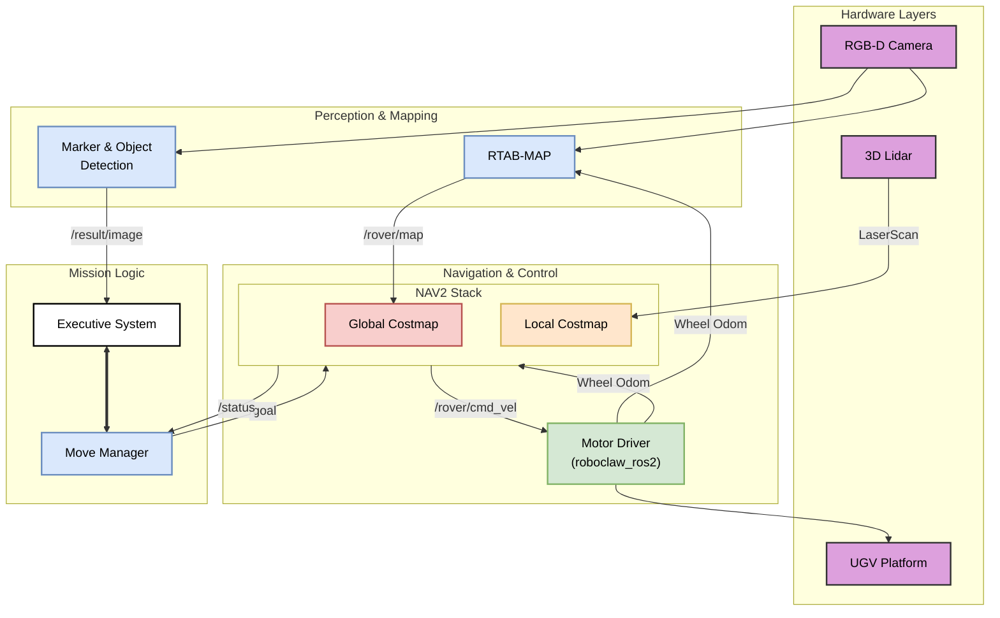

<!-- GETTING STARTED -->
# PRISMA-CoRE: UGV Software Stack

[](https://docs.ros.org/en/humble/index.html)
[](https://www.apache.org/licenses/LICENSE-2.0)
[]()

This repository hosts the complete software stack for the Unmanned Ground Vehicle (UGV) developed within the **PRISMA-CoRE** (Cooperative Robotic Exploration) research framework. The system is designed to operate in GPS-denied environments, providing autonomous capabilities for navigation, mapping (SLAM), and advanced perception, both in standalone mode and as part of a heterogeneous team (UAV–UGV collaboration).

## 1. System Architecture

The rover's software architecture is based on ROS 2 Humble and follows a modular approach that clearly separates perception, planning, and control. The data flow integrates multiple sensors (LiDAR, RGB-D camera, wheel odometry) to ensure operational robustness.



### Key Components
*   **SLAM & Localization**: **RTAB-Map** is at the core of localization, fusing visual (RGB-D) and inertial/wheel odometry for robust pose estimation even without GPS.
*   **Navigation**: Based on **Nav2**, featuring:
    *   *Global Planner*: `NavfnPlanner` for optimal long-range pathfinding on the static map.
    *   *Local Planner*: `TEB Local Planner`, optimized for the rover's skid-steer kinematics and dynamic obstacle avoidance.
*   **Perception**: 
    *   `yolov11_ros2` for real-time object recognition.
    *   `aruco_detector_ocv_ros2` for fiducial marker pose estimation.
*   **Mission Control**: A cognitive **Executive System** orchestrates high-level operations, communicating with the `rover_manager` node to translate abstract goals into navigation actions.

## 2. Repository Structure

The package organization reflects the system's modularity:
```
src/
├── git/                      # External submodules and dependencies
│   ├── costmap_converter
│   └── teb_local_planner
└── pkg/                      # PRISMA project-specific packages
    ├── aruco_detector_ocv_ros2   # ArUco marker detection
    ├── custom_explorer           # Autonomous exploration strategies
    ├── roboclaw_ros2             # RoboClaw motor controller driver
    ├── rover_bringup             # Main launch files and configurations
    ├── rover_description_pkg     # URDF/Xacro models of the rover
    ├── rover_gazebo              # Simulation environments and configurations
    ├── rover_manager             # State and movement management node
    ├── rplidar_ros               # 2D/3D LiDAR driver
    └── yolov11_ros2              # YOLOv11 inference node
```
## 3. Prerequisites
Before setting up the project, you have to install docker. If you already installed docker, go to the next session
```sh
# Add Docker's official GPG key:
sudo apt-get update
sudo apt-get install ca-certificates curl gnupg
sudo install -m 0755 -d /etc/apt/keyrings
curl -fsSL https://download.docker.com/linux/ubuntu/gpg | sudo gpg --dearmor -o /etc/apt/keyrings/docker.gpg
sudo chmod a+r /etc/apt/keyrings/docker.gpg

# Add the repository to Apt sources:
echo \
  "deb [arch=$(dpkg --print-architecture) signed-by=/etc/apt/keyrings/docker.gpg] https://download.docker.com/linux/ubuntu \
  $(. /etc/os-release && echo "$VERSION_CODENAME") stable" | \
  sudo tee /etc/apt/sources.list.d/docker.list > /dev/null
sudo apt-get update

# Install the Docker packages
sudo apt-get install docker-ce docker-ce-cli containerd.io docker-buildx-plugin docker-compose-plugin

# Add docker user
sudo groupadd docker
sudo usermod -aG docker $USER
newgrp docker
```
Then log out and log in.

## Image Compilation and Execution

1. Clone the repo (complete the command)
```sh
git clone https://github.com/
```
2.  Open a terminal in the repo and source the build file
```sh
source docker_build.sh <IMAGE_NAME>
```
where <IMAGE_NAME> is a name for the image you want to build.

3. In the terminal in the repo, source the run file
```sh
source docker_run.sh <IMAGE_NAME> <CONTAINER_NAME>
```
where <IMAGE_NAME> is the name of the image you have just built, while <CONTAINER_NAME> is a name for the container hosting the image.

### Notes 
1. The container's root password is "user" by default.

2. The container will be automatically destroyed once exited (--rm flag). If you want to attach additional terminals to the container you need to keep it running (docker_run.sh script). You can attach a new terminal by running the following command
```sh
docker exec -it $(docker ps -aqf "name=<CONTAINER_NAME>") bash
```
3. It is recommended to check the correct time for successful image creation 
4. All apt-get performed inside the container will be removed one che container is closed. Please add all new dependacies to the Dockerfile and rebuild the image.
   
## 4. Usage
1. Create a container using this project image on both rover PC an controller PC
2. Set the same ROS domain ID on both rover PCs
```sh
export ROS_DOMAIN_ID=X #number
```
3. Check if the containers times are synchronized, if not use:
 ```sh
sudo date --set="aa-dd-mm h:m:s.ms"
```
4. On the robot terminal source the workspace, compile the project and source the bash.rc:
 ```sh
colcon build --symlink-install
source ./install/setup.bash
```
5. Launch all the nodes on the robot via:
```bash
ros2 launch rover_bringup rover_bringup.launch
```
6. On the controller PC terminal open rviz2

### Full System Launch (Navigation + Perception)
To start the entire stack (sensor drivers, Nav2, RTAB-Map, Manager):

ros2 launch rover_bringup rover_bringup.launch


### Launching Individual Components
If needed, you can start specific drivers separately:

*   **RealSense Camera:**
    ```
    ros2 launch rover_bringup rs_camera.launch.py
    ```
*   **Lidar:**
    ```
    ros2 launch rover_bringup livox_launch.py
    ```

## 5. Configuration

Key parameters are defined in YAML and Launch files:

*   **Navigation (Nav2 & TEB):**
    `src/pkg/rover_bringup/config/nav2_params.yaml`
    *Here you can adjust maximum speeds, the robot's footprint, and costmap weights.*

*   **SLAM (RTAB-Map):**
    Configured via arguments in the `rtabmap.launch.py` file. Parameters include loop closure thresholds and map resolution.

*   **Vision (YOLO):**
    The `.pt` weight models and confidence thresholds are managed within the `yolov11_ros2` package.

## 6. Citation

If this work is useful for your research, please cite the associated PRISMA-CoRE paper:

```bibtex
@article{prisma_core_2025,
  title     = {PRISMA-CoRE: A Cooperative Robotic Exploration Framework for GPS-denied Environments},
  author    = {D'Angelo, Simone and Scognamiglio, Vincenzo and et al.},
  journal   = {Drones},
  year      = {2025},
  publisher = {MDPI}
}
```

## 7. License

The source code is released under the **Apache 2.0 License**.


   
   
   
   
   
   
   
   
   
   
   
   
   
   
   

